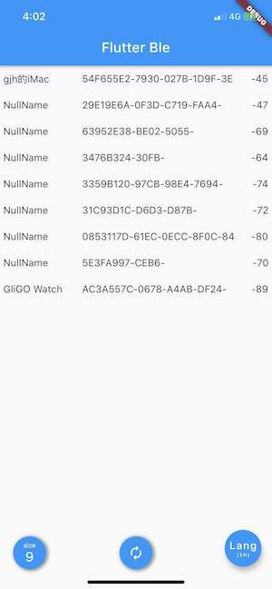
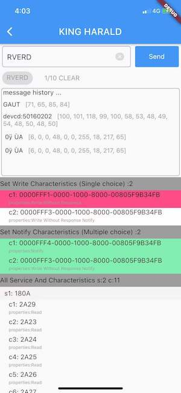

# ble

A Flutter plugin to BlueTooth Device.Supports iOS,Android.Not all methods are supported on all platforms.

CSDN: [https://blog.csdn.net/weixin_39931106/article/details/108166273](https://blog.csdn.net/weixin_39931106/article/details/108166273)

## Getting Started

To import `ble`'
```
    import 'package:ble/ble.dart';
```
To use `ble` 
```
    
    // init ble 
    Ble.getInstance();
    
    // implements
    implements DeviceListener
    
    // add listener
    @override
    void initState() {
       super.initState();
       Ble().setDeviceListener(this);
    }

    // use methods
    GestureDetector(
        onTap: () {
               Ble.getInstance().startScanBluetooth;
        },
        chile:...                   
    
```

## ProGuard
```

-keep class com.lg.ble.BleDeviceBean  { *; }
```

Android minSdkVersion>=18,Don`t forget add permission and request.

## screeenshots

 

## License
```
Copyright 2020 Zackratos

Licensed under the Apache License, Version 2.0 (the "License");
you may not use this file except in compliance with the License.
You may obtain a copy of the License at

    http://www.apache.org/licenses/LICENSE-2.0

Unless required by applicable law or agreed to in writing, software
distributed under the License is distributed on an "AS IS" BASIS,
WITHOUT WARRANTIES OR CONDITIONS OF ANY KIND, either express or implied.
See the License for the specific language governing permissions and
limitations under the License.
```

